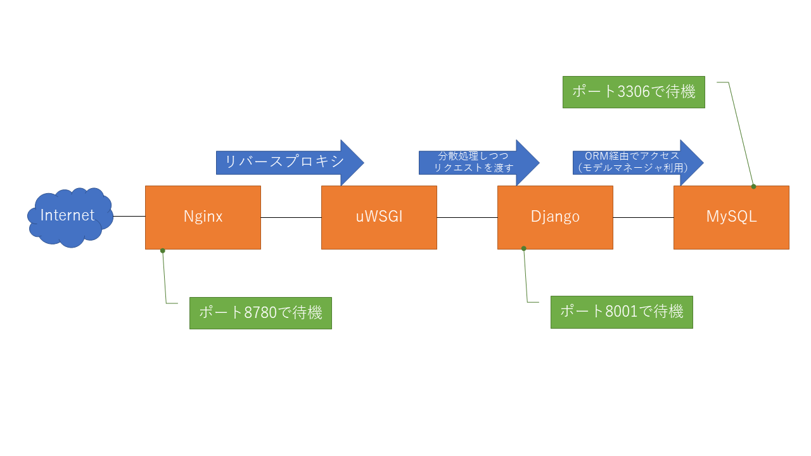

## 前提
以下のコマンドがインストール済みであること。
* docker
* docker-compose

## 使い方
1. 以下のコマンドでビルドを行う。

    ```bash
    docker-compose build
    ```

1. コンテナを起動する。

    ```bash
    docker-compose up -d
    # 最初は、mysqlがデータベースを作成する。作成中にdjangoがDBにアクセスするため、うまく起動しないときがある。
    # その場合、一度、コンテナを破棄し、再度構築する。
    docker-compose down
    docker-compose up -d
    ```

## 構成
 

## 簡単な解説
### Nginx
```nginx
# ==========
# nginx.conf
# ==========

# ユーザの指定。インストール時に追加されるnginxユーザを指定する。
user  nginx;
# 起動するプロセス数。autoでNginx側に任せる。
worker_processes  auto;
# エラーログの出力パス。問題があったときは、この内容を解析する。
#「error」は出力レベル。infoとかdebugとかがあった気がする。
error_log  /var/log/nginx/error.log  error;
# PID（Process ID）のパス。詳細は知らない。
pid        /var/run/nginx.pid;

# 接続数の上限
events {
    worker_connections  1024;
}

http {
    # Content-Typeをもとに、URLの処理方法を決定する際に利用する情報。txt/planeやapplication/jsonなど。
    include       /etc/nginx/mime.types;
    # デフォルトのMIME typeを指定する。
    default_type  application/octet-stream;

    # ログ出力時のフォーマット。接続元や接続時の時間が出力される。
    log_format  main  '$remote_addr - $remote_user [$time_local] "$request" '
                      '$status $body_bytes_sent "$http_referer" '
                      '"$http_user_agent" "$http_x_forwarded_for"';
    # アクセスログの出力パス
    access_log  /var/log/nginx/access.log  main;

    # コンテンツのファイルの読み込みとクライアントへのレスポンスの送信にsendfile() APIを利用するか否かの設定。onにするとkernel内で処理が終わるので、効率化されるらしい。
    sendfile           on;
    # エラーページにNginxのバージョン表示を表示するか否かの設定。セキュリティ上、offが望ましい。
    server_tokens      off;
    # HTTPの持続的な接続時間。長くするとプロセスが増える。
    keepalive_timeout  65;
    # ファイル一覧（ディレクトリ階層）の有効化の設定。Googleで「Index Of /」と画像検索かけると、色々出てくる。
    autoindex off;
    # 個別のconfファイルを読み込む。
    include /etc/nginx/conf.d/*.conf;
}
```

```nginx
# ============ #
# default.conf #
# ============ #

# djangoにuWSGIでリクエストを渡すための設定
# 下記にある「location /」と合わせて確認すると理解が進む。
upstream to_django {
    # 同じアドレスからのリクエストは同じサーバに到達することを保証（サーバが利用可能で無い場合を除く）
    ip_hash;
    # リクエストを渡す先
    # dockerの場合、サービス名で名前解決ができるため、djangoとしている。
    # 通常は、192.168.11.4:8001など、宛先のマシンのIPアドレスとポートが分かるように設定する。
    server django:8001;
}

# virtual serverごとの設定。ドメイン（server_name部分）ごとにリバースプロキシしたいときに有効。
# 今は、1つのみのため、ありがたみがあまりない。
server {
    # 80番のポートとして待ち受けることを明記
    listen 80;
    # サーバ名。localhostなど。dockerの場合、内部情報の詳細が分かっていないので、「_」で誤魔化す。
    server_name _;
    # 文字コード
    charset utf-8;
    # アクセスログの設定
    access_log /var/log/nginx/access.log main;
    # エラーログの設定
    error_log /var/log/nginx/error.log error;
    # Nginxのアップロードサイズの上限。不足したら、こちらのサイズを大きくする。
    client_max_body_size 75M;

    # 仮想ディレクトリ「/static」に対する処理
    location /static {
        # 実ディレクトリ「/static」にエイリアス。Linuxファイルシステムの「/static」を表現していることと等価。
        # 「/etc/nginx」とかすると、/etc/nginx以下のファイル（設定ファイルなど）がクライアント側で見えてしまうので、注意。
        alias /static;
    }

    # 仮想ディレクトリ「/media」に対する処理
    location /media {
        alias /media;
    }

    # =============
    # faviconの設定
    # =============
    location /favicon.ico {
        access_log off;
        empty_gif;
        log_not_found off;
    }

    # サイトのトップページにアクセスがあった場合
    location / {
        # uWSGIで待ち受けているDjango側にリクエストを渡す。
        # 詳細は、upstream to_djangoを参照。
        uwsgi_pass to_django;
        # uWSGIに渡す際のパラメータ情報。変更することはない。
        include /etc/nginx/uwsgi_params;
    }
}
```

### Django
#### uWSGIを利用するための設定
```uwsgi
[uwsgi]
# uWSGIを起動する際のユーザ設定
# 今回のdocker imageでは、uwsgiユーザを作成しているため、このユーザで起動。
user           = uwsgi
uid            = uwsgi
gid            = uwsgi
# uwsgiが動作するルートディレクトリの指定
chdir          = /code
# djangoに含まれているwsgiファイルを指定
wsgi-file      = /code/sample_gps/wsgi.py
# uWSGI接続時のログの出力パス。問題が発生したときは、こちらのログを解析する。
logto          = /var/log/uwsgi.log
# 起動するアプリケーション。「chdir」で指定したディレクトリからの相対パスで指定。
# 「/」ではなく「.」で参照する。以下の場合、「sample_gps/wsgi.py」の「application」を利用することを意味する。
module         = sample_gps.wsgi:application
# マスターモードの実行有無。詳細は知らない。
master         = true
# スレッドを使用するかの有無
enable-threads = true
# 「マルチプロセス＆マルチスレッドでリクエストを処理する時起こる問題」として「Thundering Herd問題」というものがあるらしい。この問題について、対策をするか否かの設定らしい。
thunder-lock   = true
# 処理する最大リクエスト数
max-requests   = 1000
# プロセス数
processes      = 1
# スレッド数
threads        = 2
# プロセス終了時にファイル/ソケットをすべて削除するか否かの設定
vacuum         = true
# ソケット情報。djangoは8001で待ち受けるので、「:8001」を指定。
socket         = :8001
# コネクションが閉じられた際の処理？詳しくは知らない
close-on-exec  = true
# SIGTERM受信時にexitするか否かの設定「falseの場合はreload」
die-on-term    = true
# moduleの監視するか否かの設定。trueと同じ意味で設定したはず...
py-autoreload  = 1
```

#### DataBaseを利用するための設定
```python
# ================================
# django/src/sample_gps/setting.py
# ================================

# Database
# https://docs.djangoproject.com/en/3.0/ref/settings/#databases

DATABASES = {
    'default': {
        'ENGINE': 'django.db.backends.mysql',           # MySQLを利用することを明記
        'HOST': os.getenv('DATABASE_HOST'),             # DBのホスト名。dockerの場合、サービス名が利用できる。
        'PORT': os.getenv('DATABASE_PORT'),             # DBに接続する際のポート番号
        'NAME': os.getenv('DATABASE_DBNAME'),           # DBアクセスするDB名
        'USER': os.getenv('DATABASE_USER'),             # DBにアクセスする際のユーザ名。アクセス先のDBに必要な権限が与えられていることが前提。詳しくは、GRANT OPTIONでググる。
        'PASSWORD': os.getenv('DATABASE_PASSWORD'),     # DBにアクセスするユーザのパスワード
        'OPTIONS': {
            'charset': os.getenv('DATABASE_CHARSET'),   # DBの文字コード。Djangoはこれで結構ハマった経験あり。
        },
    }
}
```